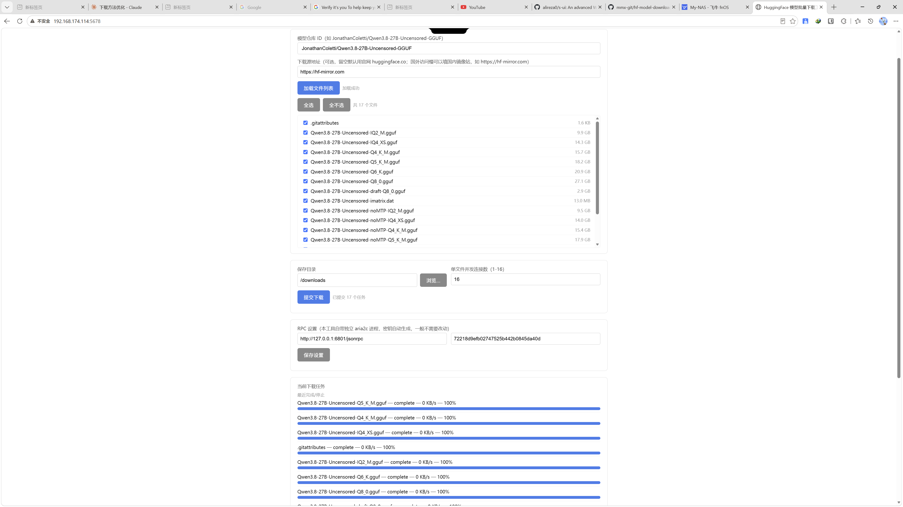

# HuggingFace 模型批量下载工具

一个跑在群晖/飞牛等 NAS（或任意 Linux 主机）本地的轻量 Web 工具，用来批量下载 HuggingFace 仓库里的模型文件。



## 功能

- 输入 HuggingFace 仓库 ID，或者直接粘贴仓库网址（完整链接 / markdown 链接格式都能自动识别）
- 自动拉取仓库全部文件列表，并显示每个文件的真实大小
- 勾选需要的文件，批量提交下载
- 后台通过独立的 `aria2c` 进程多线程下载（每个文件默认 16 并发连接），不依赖任何第三方下载器的 RPC
- 网页可视化查看下载进度，5 秒自动刷新
- 保存目录支持点击浏览选择，不用手动输入完整路径

## 背景

起因是 Windows 上一些 HuggingFace 模型下载器工具体验很好（自动解析仓库文件列表、批量勾选下载），但群晖/飞牛类 NAS 自带的下载器（比如 Trim）只认直链，不支持仓库自动解析，于是写了这个小工具自己在 NAS 本地跑。

## 依赖

```bash
pip3 install flask requests --break-system-packages
apt install aria2 -y   # 需要系统装有 aria2c 命令行工具
```

## 运行

```bash
python3 app.py
```

浏览器打开 `http://<你的NAS地址>:5678` 即可使用。

## 后台运行 / 开机自启

参考仓库里的 `hf-downloader.service`，配置为 systemd 服务：

```bash
cp hf-downloader.service /etc/systemd/system/
# 根据实际路径修改 service 文件里的 WorkingDirectory 和 ExecStart
systemctl daemon-reload
systemctl enable hf-downloader
systemctl start hf-downloader
```

## 网络提示

HuggingFace 的 Xet 存储后端（走 AWS CDN）在国内网络环境下有时会被限速，工具默认走 `huggingface.co` 直连（不走镜像站，因为镜像站的 308 重定向在部分场景下反而不稳定），如果所在环境有代理，走代理出网即可获得更好的下载速度。

## 许可

MIT
